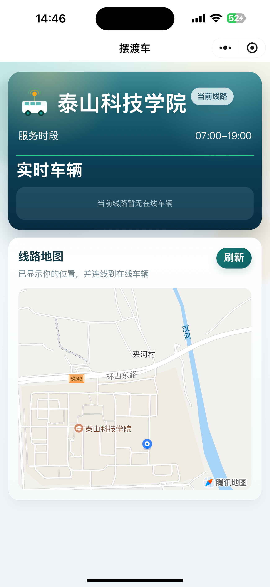

# Shuttle 校园摆渡车通行

这是一个校园摆渡车定位项目，包含后端服务、司机端微信小程序、用户端微信小程序三部分。

## 项目结构

```text
.
├─ backend-springboot/   后端接口
├─ driver-miniapp/       司机端微信小程序
└─ user-miniapp/         用户端微信小程序
```

## 技术栈

- 后端：Spring Boot 3.3.2
- 数据库：MySQL 8
- 小程序：微信小程序原生开发
- 地图：腾讯地图

## 目录说明

### `backend-springboot`

后端负责账号绑定、登录态管理、线路查询、车辆实时状态、轨迹历史以及 WebSocket 推送。

### `driver-miniapp`

司机端小程序

- 位置权限检查与引导
- 前后台切换后恢复自动上报
- 按节流频率上传定位

### `user-miniapp`

用户端小程序

- WebSocket 断线重连
- 地图 Marker 聚合与动画
- 根据位置更新时间推导车辆速度

## 本地启动

### 1. 准备环境

- JDK 17
- Maven 3.9+
- MySQL 8
- 微信开发者工具

### 2. 创建数据库

```sql
CREATE DATABASE shuttle_demo DEFAULT CHARACTER SET utf8mb4 COLLATE utf8mb4_general_ci;
```

### 3. 启动


